# osi1
# Лабораторная работа 1

задача на с++ про факториал так как ровно такую же брали в начале прошлого семетра на языках программированния 

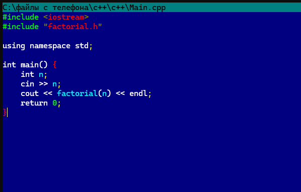
запуск с оптимизацией 0
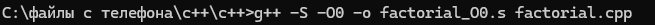
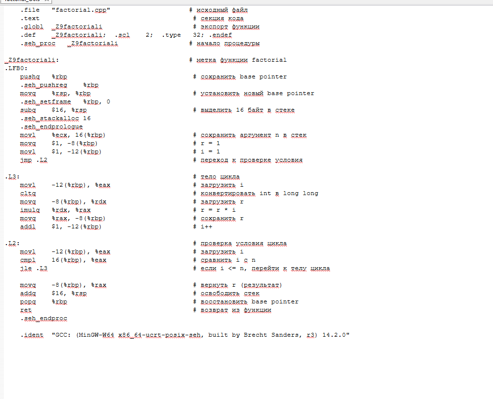
запуск с оптимизацией 3
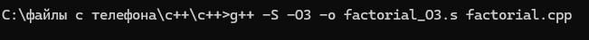
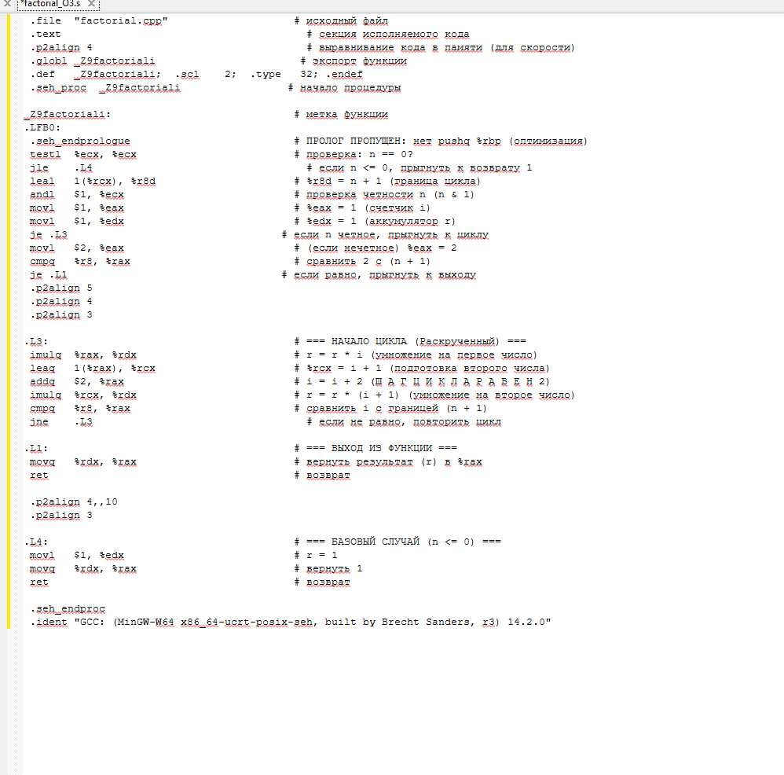
подключаем git
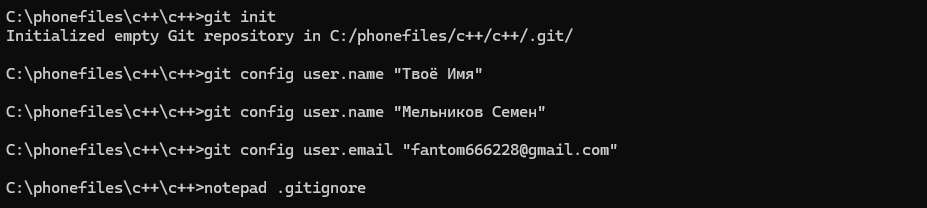
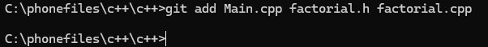
вносим коммит
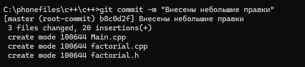
подключаем makefile
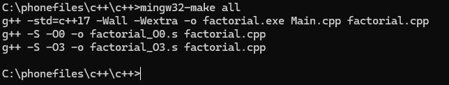
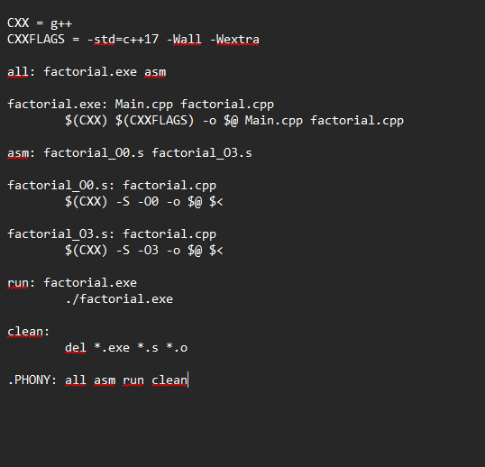
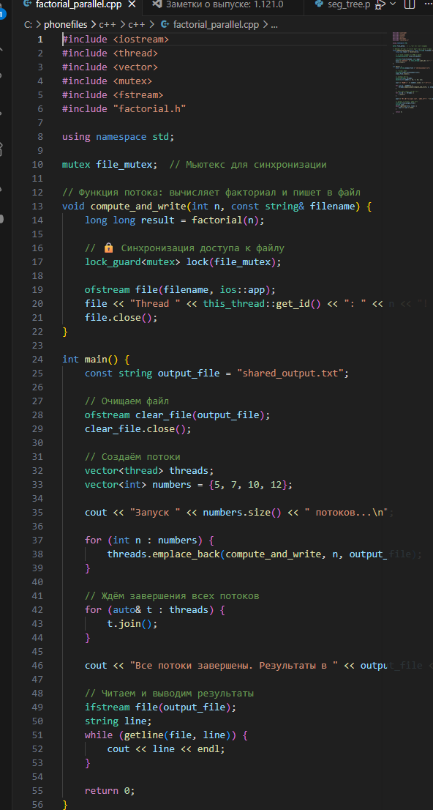
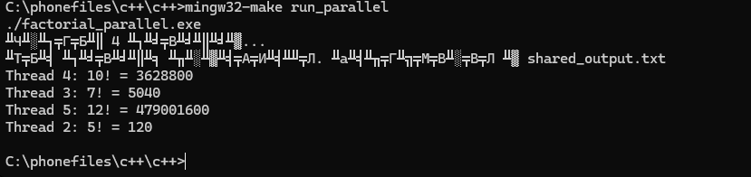
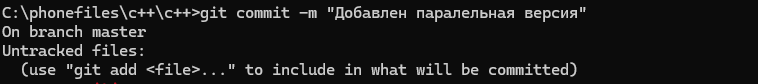
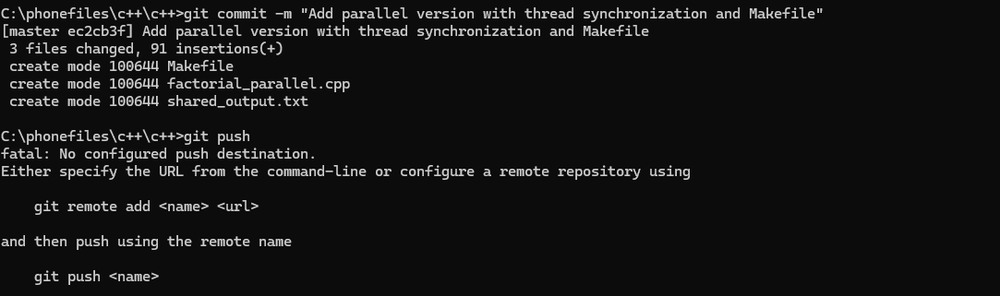
##лаброторная 2
https://disk.yandex.ru/d/IlXVKqNnyPhUsg
##лаброторная 3
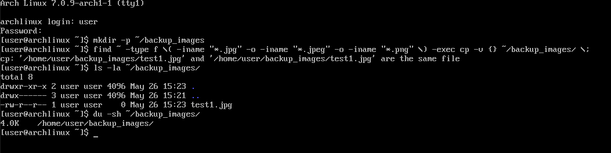
тоже самое на винде
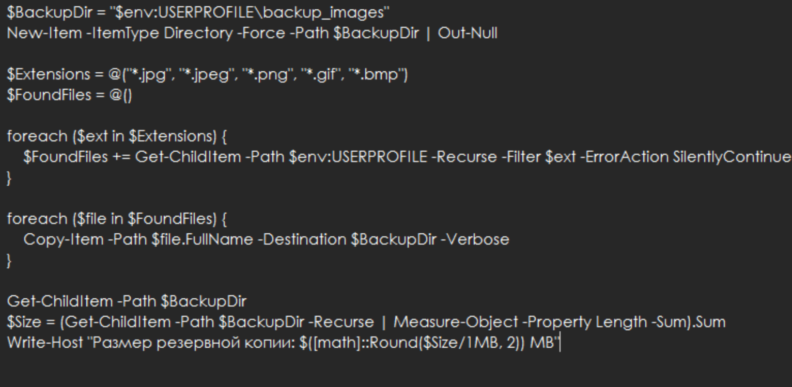
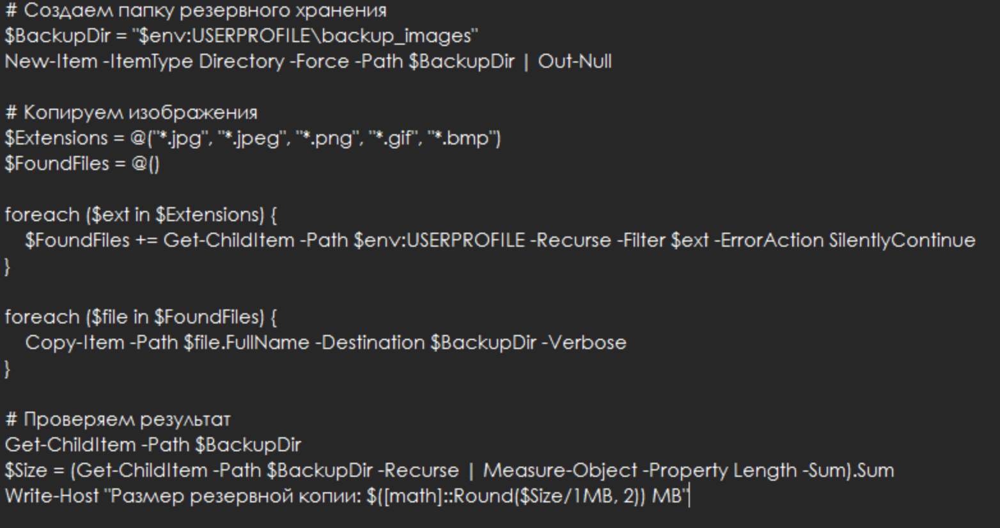
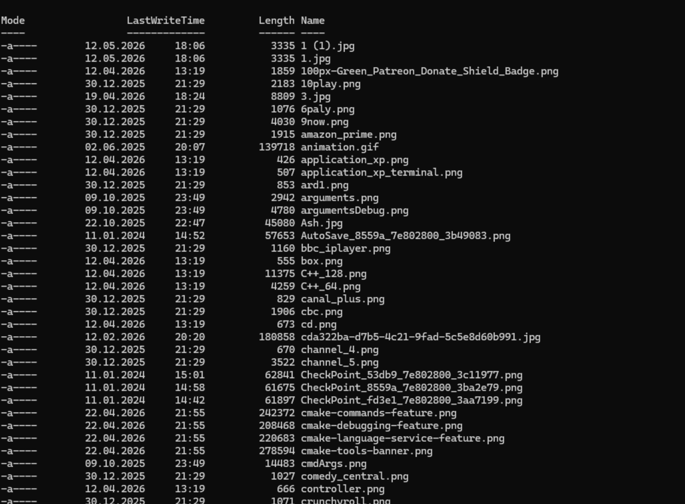
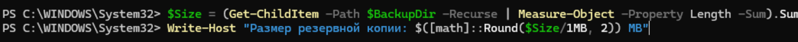
